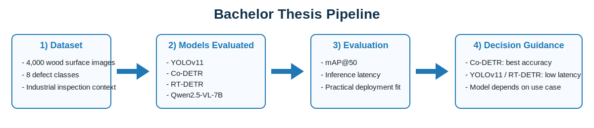
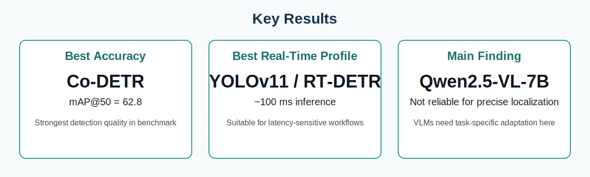

# Bachelor Thesis: Automated Defect Detection in Wooden Surfaces

Applied machine learning project focused on industrial-quality inspection with object detection.

## Quick Profile (for employers)

- **Author:** Tobias Furtlehner
- **Program:** Data Science and Business Analytics (BSc)
- **Thesis topic:** Automated defect detection on wooden surfaces using deep learning
- **Core value:** Practical comparison of model families under real deployment constraints (accuracy vs speed)

## Executive Summary

In this thesis, I built and evaluated a benchmark for automated wood defect detection using modern detection models and a multimodal LLM baseline.

The central question was not only "Which model is most accurate?" but also "Which model is best suited for production use?".
To answer that, I compared detection quality and inference latency side by side and translated results into deployment-oriented recommendations.



## Problem Context

Manual quality control for wood surfaces is repetitive, costly, and hard to scale consistently.
Even small defects can impact downstream product quality, so reliable automated inspection has clear economic value.

This project investigates whether current deep learning approaches can provide robust defect detection performance for such environments.

## What I Built

- End-to-end evaluation setup for defect detection models
- Structured comparison across different architecture paradigms
- Quantitative benchmark on a dataset of **4,000 images** and **8 defect classes**
- Result interpretation focused on practical deployment decisions

## Models Evaluated

- **YOLOv11** (convolutional detector, optimized for speed)
- **Co-DETR** (transformer-based detector, optimized for high detection performance)
- **RT-DETR** (real-time transformer detector)
- **Qwen2.5-VL-7B** (multimodal vision-language model used as a baseline)

## Evaluation Method

- **Primary quality metric:** `mAP@50`
- **Operational metric:** inference latency
- **Decision lens:** accuracy-speed trade-off for industrial settings

This combination ensures that findings are useful not only academically, but also for engineering and operations stakeholders.

## Key Results

| Focus | Outcome |
|---|---|
| Best detection quality | **Co-DETR** with **mAP@50 = 62.8** |
| Best real-time suitability | **YOLOv11** and **RT-DETR** at around **100 ms** inference |
| VLM baseline behavior | **Qwen2.5-VL-7B** was not reliable for precise spatial defect localization |



## Practical Takeaways

- Choose **Co-DETR** when maximizing detection quality is the top priority.
- Choose **YOLOv11** or **RT-DETR** when latency and throughput are critical.
- Do not assume that multimodal LLMs outperform specialized detectors on localization-heavy tasks.

## Limitations and Next Steps

- Dataset characteristics (uniformity and class imbalance) can influence generalization.
- Next steps include broader data diversity, targeted balancing strategies, and validation in additional production contexts.
- Future work can also test hybrid pipelines (fast detector + secondary high-precision verification model).

## Skills Demonstrated

- Applied deep learning model evaluation in a real domain
- Comparative benchmarking and metric-driven decision making
- Translation of ML results into business/engineering recommendations
- Scientific communication and documentation with LaTeX

## Repository Structure

- `Bachelorarbeit/` - complete thesis LaTeX project
- `Bachelorarbeit/user_data/` - chapter content, abstracts, bibliography
- `Bachelorarbeit/gfx/` - thesis figure sources
- `Bachelorarbeit/00_main.tex` - LaTeX entry point
- `assets/` - README visuals for GitHub presentation

## Build Thesis PDF (optional)

```bash
cd Bachelorarbeit
make
```

Generated output: `Bachelorarbeit/out/thesis.pdf`
